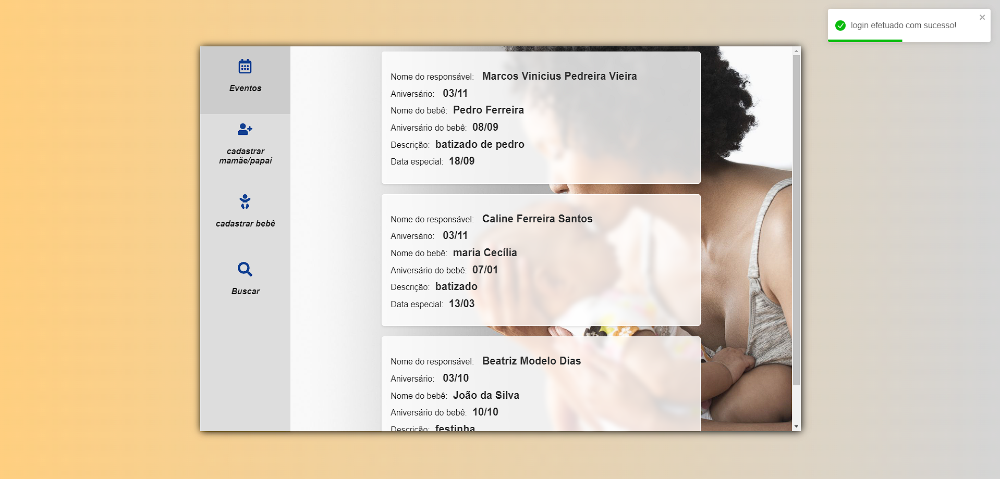

# Afflatus Assistant

 

**A motivação:** -  Atualmente, a empresa tem uma grande necessidade de um sistema robusto de administração de dados dos clientes. Para atender a essa necessidade, implementei um cadastro completo do cliente e também de seu filho(a), além de uma sessão de eventos, levando em consideração as datas de aniversário do cliente, dos filhos e também de alguma data especial que o mesmo creia ser importante. Como resultado, o sistema trará um aumento na organização dos clientes e também um lucro voltado a sessões fotográficas dos eventos mais importantes.

 

**Afflatus Assistant** é um sistema de cadastro e gerenciamento de clientes de uma empresa de fotografia infantil desenvolvido em React Js.

Ainda está em fase de desenvolvimento, porém sua estrutura é bem componentizada, permitindo assim qualquer tipo de expansão futura.

Sinta-se à vontade para dar uma olhada na construção do código.

**Observação importante:** Você irá precisar do repositório backend para executar a aplicação.

 

### Instalação:
1- baixe esse repositório em sua máquina. 

2- Para instalar as bibliotecas, utilize o comando `npm install` no terminal dentro da pasta do código.

3- Por fim, utilize o comando `npm run dev` para visualizar a aplicação em seu navegador web.

4- quaisquer dúvidas, por favor entre em contato comigo.
 

### Caso que não queira instalar/baixar:

 

Esse é o sistema, caso você não queira baixar:

     

**1- Tela de login** (para testar utilize: usuario: vini  senha:123456 )

 

 
 

**2- Tela principal(dashboard)** - tela de cadastros de clientes e visualização de eventos de cada um.

### Próximos passos: ###
1- implementação da página de busca avançada com a biblioteca MUI. (em desenvolvimento). 

2- implementação do módulo de produtos.

3- sistema de emissão de relatórios.

4- sistema de emissão de pagamentos e NF-e.
